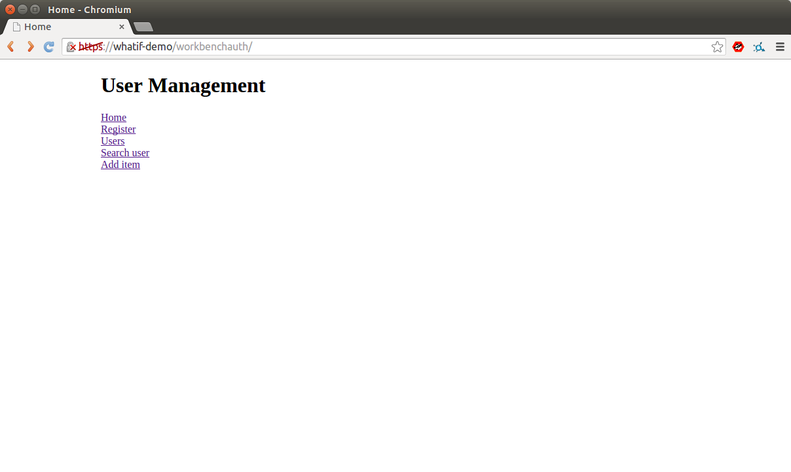
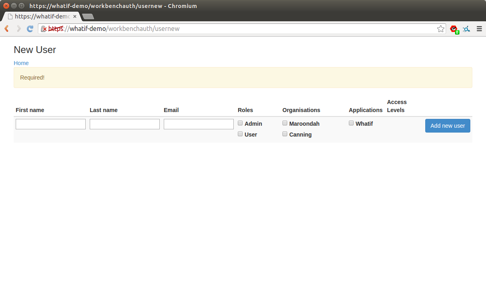
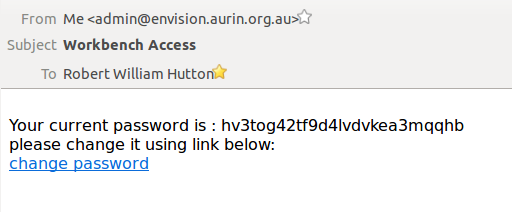
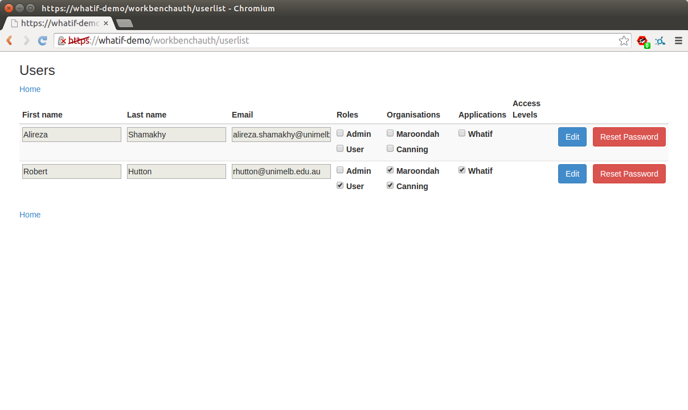
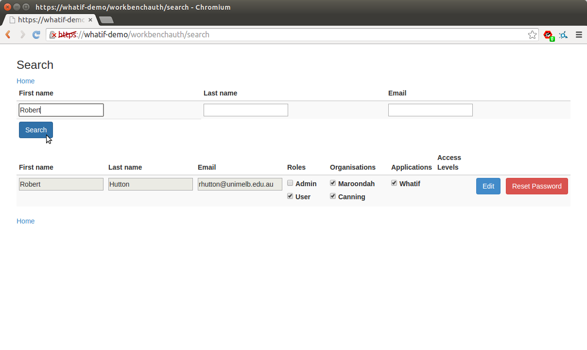
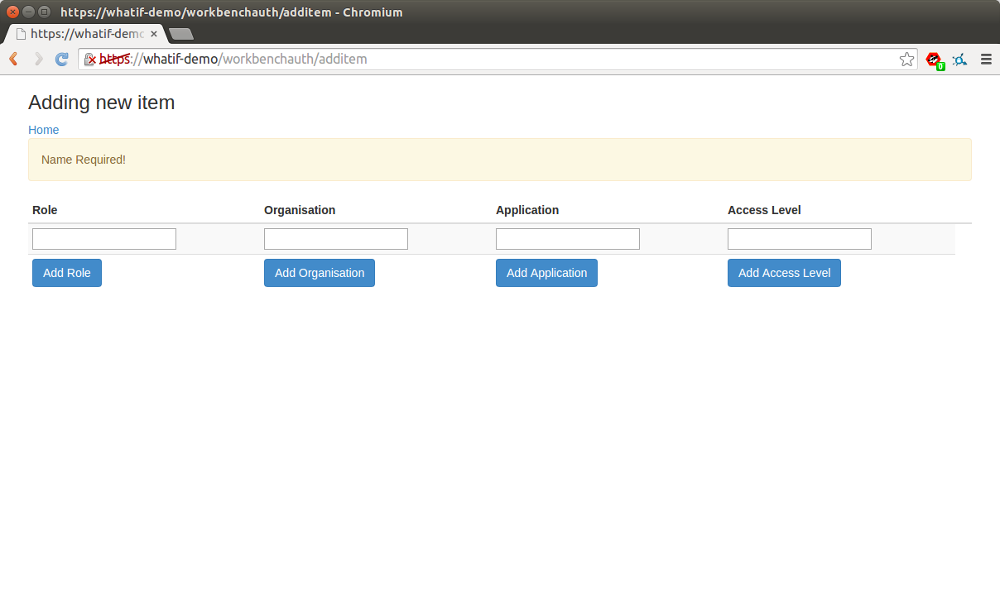

# WorkbenchAuth user guide

For information on installing and configuring WorkbenchAuth, please see the [WhatIf installation guide](https://github.com/AURIN/online-whatif/blob/master/INSTALL.md).  Please note that WorkbenchAuth requires access to an SMTP daemon in order to function, as it sends temporary passwords to new users via email.

Once you have followed the installation instructions, you can log in to the [workbenchauth administrative system](https://whatif-demo/workbenchauth).  Log in with the username and password from /etc/envision-combined.properties.  You will see the home page:

This page allows you to access all of the administrative functions of the system.

## Adding a new user

To add a new user, click the [Register](https://whatif-demo/workbenchauth/usernew) link.  You will see the following page:

Simply type in the user's name and email address, and choose what role(s), organisation(s) and applications they should have access to, then click Add new user.  An email will be sent to the user with a temporary password and a link allowing them to change their password:

A list of registered users is available by clicking on the [Users](https://whatif-demo/workbenchauth/userlist) link:

From this page, the users' attributes can be modified by clicking on the corresponding checkboxes under Roles, Organisations, and Applications, then clicking on Edit.

The Search User page is like the Users page except it allows you to search through the users before making changes.

The Add item page allows you to add new Roles, Organisations, Applications or Access levels.  These can then be associated with users.

